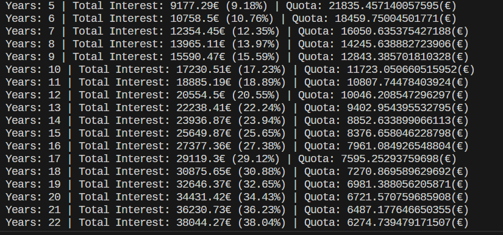
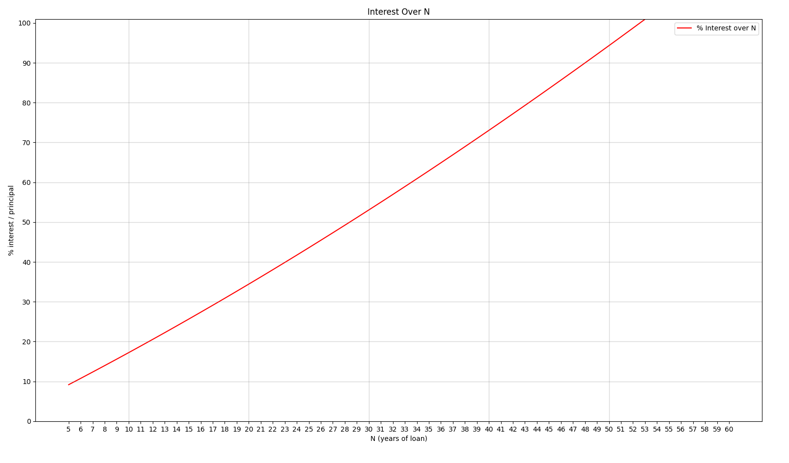
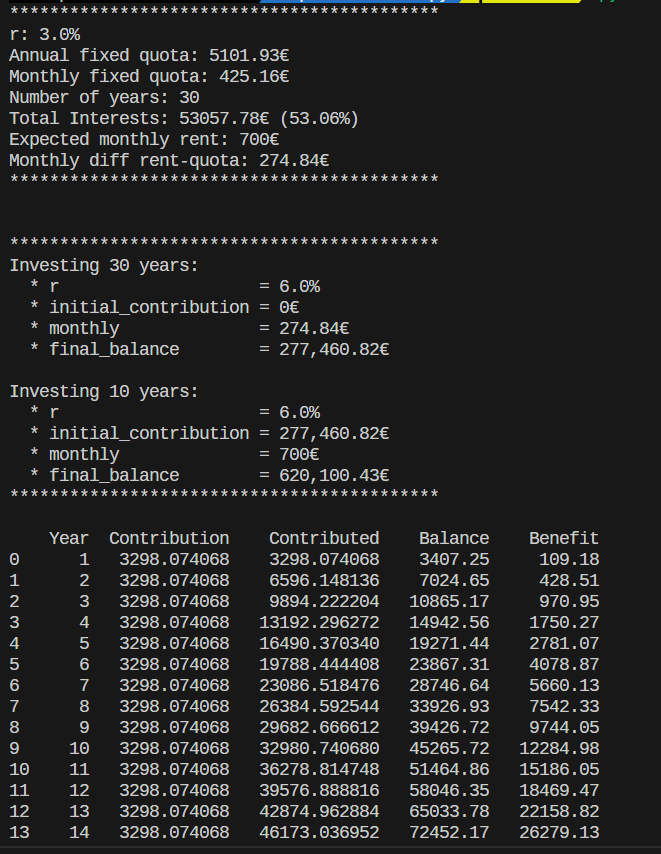
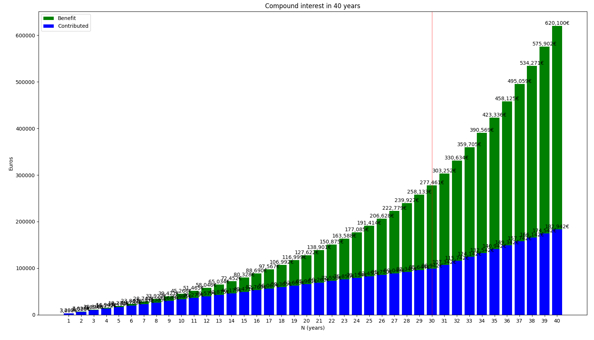

# 💼📈 EconPy: Economic Calculations Made Simple with Python 📉💰

Sure, here is the index for your markdown:

## Index
- [💼📈 EconPy: Economic Calculations Made Simple with Python 📉💰](#-econpy-economic-calculations-made-simple-with-python-)
0. [Introduction](#0-introduction)
1. [Loan Calculator](#1-loan-calculator)
    - [Configuration](#configuration)
    - [Execution](#execution)
2. [Interest Total Calculator](#2-interest-total-calculator)
    - [Configuration](#configuration-1)
    - [Execution](#execution-1)
3. [Compound Interest Calculator (investing monthly)](#3-compound-interest-calculator-investing-monthly)
    - [Configuration](#configuration-2)
    - [Execution](#execution-2)
4. [Loan vs Investment in Funds](#4-loan-vs-investment-in-funds)
    - [4.1 Calculate the Final Balance over loan years](#41-calculate-the-final-balance-over-loan-years)
      - [Configuration](#configuration-3)
      - [Execution](#execution-3)
    - [4.2 Completely Balance breakdown for fixed loan years](#42-completely-balance-breakdown-for-fixed-loan-years)
      - [Configuration](#configuration-4)
      - [Execution](#execution-4)

## 0. Introduction
Welcome to EconPy, your one-stop repository for Python scripts designed to make complex economic calculations a breeze. Dive into the world of investments, loans, and financial planning with our easy-to-use scripts.

## 1. Loan Calculator
Tool to calculate all the useful information for the borrower regarding to a Loan. The *Quota*, *Interest*, *Amortization*, etc. Based on **Loan Amortization** method, explained in [theory/economy.pdf](theory/economy.pdf)

#### Configuration
Configurable Parameters:
| Parameter | Explanation                                        |
|--------------------|----------------------------------|
| **principal (int)** | ammount of money borrowed |
| **period (str)** | type of period (month, years) |
| **N (int)** | total number of periods |
| **r (float)** | annual interest rate (in %) |
| **want_csv (bool)** | to export results into a CSV |
| **CSV_FILE (str)** | name of the .csv file |
| **plot (bool)** | plot results |

#### Execution
```bash
python3 main_loan.py
```


## 2. Interest Total Calculator
Tool to study how the *Interest Total* changes depending on the number of periods (in this case, years).

#### Configuration
Configurable Parameters:
| Parameter | Explanation                                        |
|--------------------|----------------------------------|
| **principal (int)** | ammount of money borrowed |
| **period (str)** | type of period (month, years) |
| **N_range (list)** | range of N's to study |
| **r (float)** | annual interest rate (in %) |
| **print_data (bool)** | verbose to see data on stdout |
| **plot (bool)** | plot results |
| **plot_data (str)** | show % or € on the graphic |


#### Execution
```bash
python3 main_loan_interest_total.py
```




## 3. Compount Interest Calculator (investing monthly)
Tool to calculate all the useful information for investor regarding to an Investment. *Benefits*, *Total Balance*, *Compound Interest*, *Monthly Contributions*, etc. All the formulas used are explained on [theory/economy.pdf](theory/economy.pdf)

#### Configuration
Configurable Parameters:
| Parameter | Explanation                                        |
|--------------------|----------------------------------|
| **principal (int)** | ammount of money borrowed |
| **period (str)** | type of period (month, years) |
| **N (int)** | total number of periods |
| **N (float)** | annual interest rate (in %) |
| **want_csv (bool)** | to export results into a CSV |
| **CSV_FILE (str)** | name of the .csv file |
| **plot (bool)** | plot results |

#### Execution
```bash
python3 main_compound_interest.py
```


## 4. Loan vs Investment in Funds
Are you planning to take out a loan to buy an **investment** and you don't know how many years to? This is your script.

It will calculate which **years** should be better to ask for planning that you are going to **rent** the **investment** and you are going to invest this money in **funds**.

### 4.1 Calculate the Final Balance over loan years
It will calculate the final balance you are going to have in the funds depending on the years you asked for the loan.

#### Configuration
| Parameter | Explanation                                        |
|--------------------|----------------------------------|
| **N_tot (int)** | total number of years |
| **verbose (bool)** | Show data on stdout |
| **to_csv (bool)** | to export results into a CSV |
| **csv_file (str)** | name of the .csv file |
| **plot (bool)** | plot results |
| **loan_principal (int)** | ammount of money borrowed in loan|
| **loan_r (float)** | loan annual interest rate (in %) |
| **loan_N (int)** | loan number of years |
| **rent_expected (float)** | ammount you expected to earn renting the property |
| **fund_init_ammount (float)** | init contribution to the investment |
| **fund_r (float)** | invesment annual interest rate (in %) |

#### Execution
```bash
python3 main_loan_vs_fund.py
```


### 4.2 Completely Balance breakdown for fixed loan years
It will completely detail the balance over years when fixed loan years.

#### Configuration
| Parameter | Explanation                                        |
|--------------------|----------------------------------|
| **N_tot (int)** | total number of years |
| **verbose (bool)** | Show data on stdout |
| **wantcsv (bool)** | to export results into a CSV |
| **CSV_FILE (str)** | name of the .csv file |
| **plot (bool)** | plot results |
| **loan_principal (int)** | ammount of money borrowed in loan|
| **loan_r (float)** | loan annual interest rate (in %) |
| **loan_N (int)** | loan number of years |
| **rent_expected (float)** | ammount you expected to earn renting the property |
| **fund_init_ammount (float)** | init contribution to the investment |
| **fund_r (float)** | invesment annual interest rate (in %) |

#### Execution
```bash
python3 main_example_loan_vs_fund.py
```



