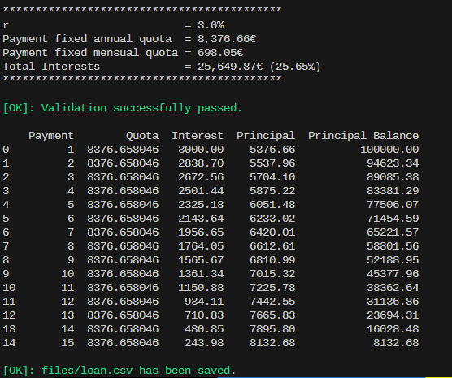
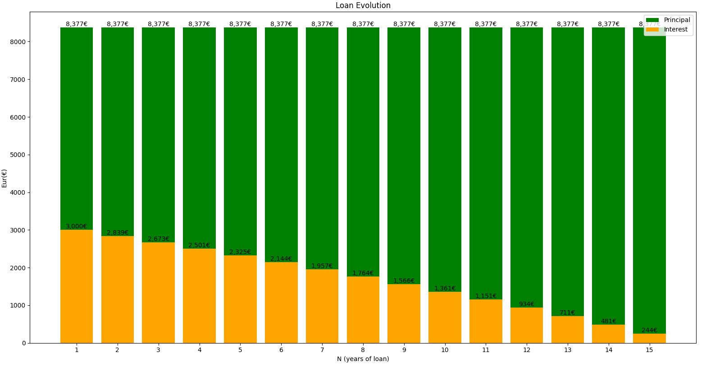
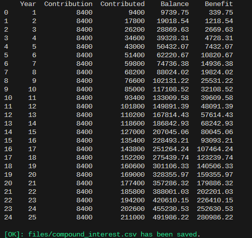
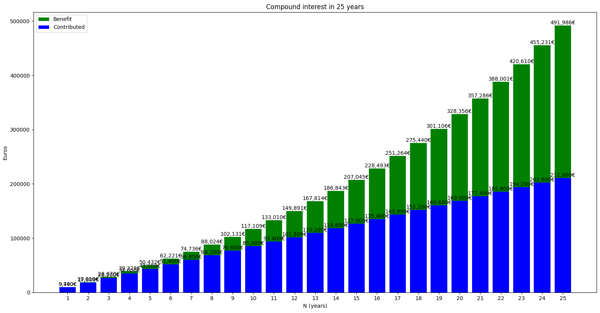

# 💼📈 EconPy: Economic Calculations Made Simple with Python 📉💰

## Introduction
Welcome to EconPy, your one-stop repository for Python scripts designed to make complex economic calculations a breeze. Dive into the world of investments, loans, and financial planning with our easy-to-use scripts.

## Utilitites

#### Loan Calculator
[README_loan_calculator.md](README_loan_calculator.md)

#### Compount Interest Calculator when investing monthly
[README_compound_interest.md](README_compound_interest.md)

