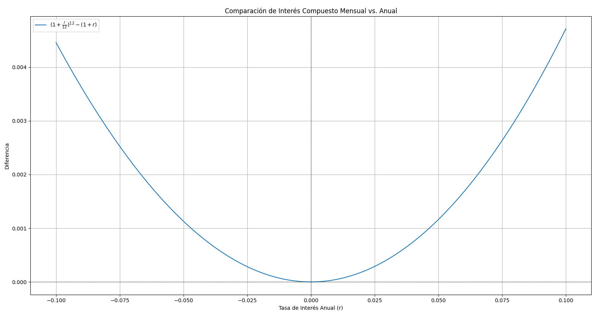

# Compound Interest Calculator

## Introduction
Compound interest calculator taking into account monthly periodical contributions.

## Definitions
- *init_contribution*
- *r: annual interest ratio (%).*
- *n: number of years investing.*
- *monthly_contribution*
- *contributed: total money you have invest*
- *balance: total money you will have*
- *benefits: total money you earned investing*

$$
contributed(n) = init\_contribution + 12 \times n  \times monthly\_contribution
$$

$$
benefit(n) = balance(n) - contributed(n)
$$

#### Contributions at the Beginning of the Month:
$$
balance(n) = init\_contribution \times (1 + \frac{r}{12})^{12t}
+ monthly\_contribution \times \frac{(1 + \frac{r}{12})^{12t} - 1}{\frac{r}{12}}
\times (1 + \frac{r}{12})
$$

#### Contributions at the End of the Month:
$$
balance(n) = init\_contribution \times (1 + \frac{r}{12})^{12t}
+ monthly\_contribution \times \frac{(1 + \frac{r}{12})^{12t} - 1}{\frac{r}{12}}
$$

> ![NOTE]
> We are taking into account the **Contributions at the Beginning of the Month**

## Compount Interest
Maybe it helps to understand better the balance formula. Let's suppose this scenario:
- *r: annual interest ratio (%) = 0.06*
- *init_contribution = 1000*
- *monthly_contribution = 0*

If we calculate the *balance* at the end of **1 year** using *r*:

$$
init\_contribution \times (1 + r) = 1000 \times 1.06 = 1060
$$

But if we calculate the *balance* taking into account that the *annual interest ratio is constant* so:
$$
r_m = \frac{r}{12}
$$

Then:
$$
init\_contribution \times (1 + r_m) \times (1 + r_m) \times ... (1 + r_m)
\newline
init\_contribution \times (1 + \frac{r}{12})^{12} = 1061,68
$$

So we can conclude that:
$$
(1 + \frac{r}{12})^{12} > 1 + r, \forall r
$$

Let's so how much: $ y = (1 + \frac{r}{12})^{12} - (1 + r) $

> [!TIP]
> And this is called **Compound Interest**. The difference is due to the frequency with which interest is applied. By applying monthly interest, we are compounding the interest 12 times a year, each time on a slightly larger amount due to the interest earned in the previous months. This generates more money than if it were applied only once a year.

**Compound interest** refers to the reinvestment of interest earned, i.e., interest earned in one period is added to the principal, and in the next period interest is earned on this new balance. This causes the total balance to grow at a higher rate compared to simple interest, where interest is only calculated on the initial principal.

So you discovered the formula applied to the *init_contribution*:
- *n: number of partions of the annual rate*
- *t: number of years*

$$
compound\_balance = init\_contribution \times (1 + \frac{r}{n})^{nt}
$$

> [!TIP]
> So we can conclude that ALWAYS **compound interest** is better than simple interest, even if *r<0*. So try to compound

## Usage
Configure and run the following script: [main_compound_interest.py](main_compound_interest.py)
