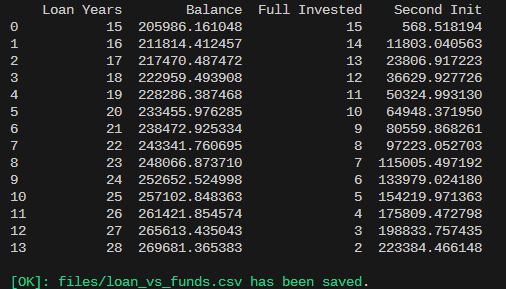

# Loan vs Investment in Funds

## Introduction
Are you planning to take out a loan to buy an **investment** and you don't know how many years to? This is your script.

It will calculate which **years** should be better to ask for planning that you are going to **rent** the **investment** and you are going to invest this money in **funds**.

## Usage

#### Calculate the Final Balance over loan years
It will calculate the final balance you are going to have in the funds depending on the years you asked for the loan.

Configure and run the script [main_loan_vs_fund.py](main_loan_vs_fund.py)

#### Completely Balance breakdown for fixed loan years
It will completely detail the balance over years when fixed loan years.

Configure and run the script [main_example_loan_vs_fund.py](main_example_loan_vs_fund.py)

